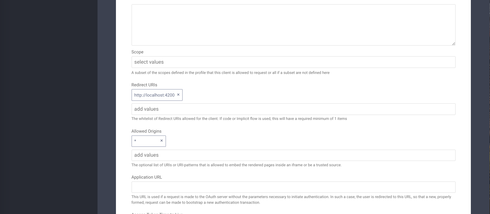

# Assisted Token

This project was generated with [Angular CLI](https://github.com/angular/angular-cli) version 1.0.0.

## Development server
In this example an api call is made to a node server using the access token received from curity server after authentication.
The sample node server exposes a rest api which mocks an authorized resource. In response of mock api call, the server returns the access token used to access the resource.
You only need to run this server in order to test this example.

Run node server as mentioned below.
```nodemon
node server/server.js
```


Run `ng serve` for a dev server. Navigate to `http://localhost:4200/`. The app will automatically reload if you change any of the source files.


In order to run both `node server` and `angular app` together, use the following command.

```nodemon
npm start
``` 

## Curity Config
In order to run this example you need to make some configurations in Curity server.    
The easiest way is to [download and install the sample configuration](https://developer.curity.io/release/2.3.1/configuration-samples) from curity docs.   
This sample configuration has already configured one `Authentication Profile` and one `OAuth Profile`. The `OAuth Profile` also has an app configured (`client-assisted-example`).   
If you are not using the sample configuration, then you need to make sure that atleast these configuration requirements are met before you make the following changes.    

1. Login into the Admin UI and update license under `System -> General`.
    
     
2. Go to OAuth profile and make sure that `Code Flow`, `Implicit Flow` and `Assisted Token` `Client Capabilities` are enabled under `Token Service -> General`.
    
    
3. Go to the `Token Service -> Apps` and edit `client-assisted-example`.
       

4. On `Token Service -> Apps -> Edit App(client-assisted-example)` page, make sure that  `Implicit Flow` and `Assisted Token` are enabled under `Client Capabilities` section.
      
    

5. Update the `Redirect URIs` and `Allowed Origins` for `client-assisted-example` OAuth App.
       
       
6. Commit the changes and you are all setup.    
    

## Integrate with Angular App  
To integrate this example into any of Angular2/4 app, you need to copy `App Component` (`app.component.html`, `app.component.ts`) into your project and add this component into your App's module.    

The 2nd thing is to copy the `AuthInterceptor.ts` and `assistant.service.ts` files into your project and then add them into your Module providers as shown below.

```typescript
@NgModule({
    declarations: [
        AppComponent
    ],
    imports: [
        BrowserModule,
        HttpClientModule
    ],
    providers: [
        AssistantService,
        {
            provide: HTTP_INTERCEPTORS,
            useClass: AuthInterceptor,
            multi: true,
        }
    ],
    bootstrap: [AppComponent]
})
export class AppModule {
}
``` 

You also need to add `HttpClientModule` in your Module imports as shown in above code.

The last thing is to configure environment variables like `issuer`, `clientId`, `apiUrl` and `authServerOrigin`.
You can see the following example environment config.

```typescript
export const environment = {
  production: false,
  issuer: "https://localhost:8443/~",
  clientId: "client-assisted-example",
  apiUrl: "http://127.0.0.1:8100",
  authServerOrigin: "http://127.0.0.1:8100"
};
```

## Build

Run `ng build` to build the project. The build artifacts will be stored in the `dist/` directory. Use the `-prod` flag for a production build.

## Further help

To get more help on the Angular CLI use `ng help` or go check out the [Angular CLI README](https://github.com/angular/angular-cli/blob/master/README.md).
